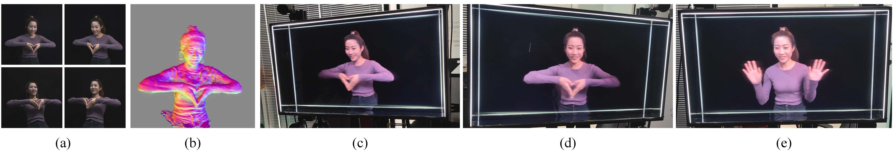
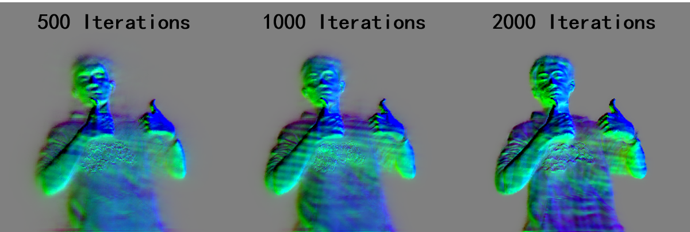

# Tensor4D : Efficient Neural 4D Decomposition for High-fidelity Dynamic Reconstruction and Rendering
### [Project Page](https://liuyebin.com/tensor4d/tensor4d.html) | [Paper](https://arxiv.org/abs/2211.11610) | [Data]()



> [Tensor4D : Efficient Neural 4D Decomposition for High-fidelity Dynamic Reconstruction and Rendering](https://arxiv.org/pdf/2211.11610.pdf)  
> Ruizhi Shao, Zerong Zheng, Hanzhang Tu, Boning Liu, Hongwen Zhang, Yebin Liu.
> (**CVPR 2023 Highlight**)

This is the official implementation of Tensor4D: Efficient Neural 4D Decomposition for High-fidelity Dynamic Reconstruction and Rendering. Tensor4D can efficiently achieve high-fidelity dynamic reconstruction and rendering with only sparse views or monocular camera:


## Installation

To deploy and run Tensor4d, you will need install the following Python libraries

```
numpy
opencv-python
torch
tensorboard
shutil
tqdm
pyhocon
glob
scipy
einops
```

We have tested Tensor4D with several PyTorch versions including 1.13 and 2.0. It is recommended to use PyTorch with these versions to ensure compatibility.

## Run the code on Tensor4D dataset

### Download Tensor4D samples

We have provided several samples for Tensor4D training. You can download the test samples using the following links:

- [thumbsup_v4](https://mailstsinghuaeducn-my.sharepoint.com/:u:/g/personal/shaorz20_mails_tsinghua_edu_cn/EbDH2JH5MplMk7iV4JYdtSUBl88UBBBBu24lUqCJ_65hMQ?e=PEfQSs) : A man giving thumbs up and waving, captured by 4 RGB cameras focusing on the front face.
- [dance_v4](https://mailstsinghuaeducn-my.sharepoint.com/:u:/g/personal/shaorz20_mails_tsinghua_edu_cn/EfpMTnVxCqNKvLR35R3a6TIBQ2i1e0NmsEJys2cCIcsxuA?e=oWpIkA) : A woman dancing in a gorgeous dress, captured by 4 RGB cameras focusing on the front face. 
- [boxing_v12](https://mailstsinghuaeducn-my.sharepoint.com/:u:/g/personal/shaorz20_mails_tsinghua_edu_cn/EcmHCmJ9NehAmtsCuBTcKxYBZSptnNPXuJrhKgCltW7Grw?e=WawpWb) : A man in a down jacket boxing, captured by 12 RGB cameras in a circle.
- [lego_v1](https://mailstsinghuaeducn-my.sharepoint.com/:u:/g/personal/shaorz20_mails_tsinghua_edu_cn/EcX8qOf9ODhGnwh_FcuR-eQBRvLFWdslN57jbKhUdOWObg?e=gkVoIn) : A LEGO excavator with a raised arm, captured by monocular camera, similar with D-NeRF dataset.

The format of our test samples is the same with [NeuS](https://github.com/Totoro97/NeuS), we will also provide scripts that convert NeRF blender dataset to our dataset.

### Run the standard Tensor4D 

To train Tensor4D for monocular cases, you can use the following scripts:

```
# Train Tensor4D with flow
python exp_runner.py --case lego_v1 --mode train --conf confs/t4d_lego.conf --gpu 0    
# Resume training
python exp_runner.py --case lego_v1 --mode train --conf confs/t4d_lego.conf --gpu 0 --is_continue
```

After training, you can visualize the results by the following scripts:

```
# interpolation between view 0 and view 2, setting the number of interpolation views to 100 and the downsampling resolution to 2

python exp_runner.py --case t4d_lego --mode interpolate_0_2 --conf confs/t4d_lego.conf --is_continue --inter_reso_level 2 --gpu 1 --n_frames 100
```

Similarly, you can train Tensor4D for multi-view cases according to the following scripts:

```
# Train Tensor4D without flow
python exp_runner.py --case thumbsup_v4 --mode train --conf confs/t4d_origin.conf --gpu 0
```

After about 50k iterations of training, you can achieve a reasonably good result. If you want higher quality results, you may need to train for a longer period of time with more iterations, such as 200k iterations.

### Run Tensor4D with image guidance

Tensor4D can be further accelerated with image guidance. Here we provide a naive implementation which directly uses the 2D CNN to extract image features as additional conditions:

```
# Train Tensor4D with image guidance on thumbsup_v4
python exp_runner.py --case thumbsup30 --mode train --conf confs/t4d_thumbsup_img.conf --gpu 0

# Train Tensor4D with image guidance on dance_v4
python exp_runner.py --case dance_v4 --mode train --conf confs/t4d_dance_img.conf --gpu 0

# Train Tensor4D with image guidance on boxing_v12
python exp_runner.py --case boxing_v12 --mode train --conf confs/t4d_boxing_img.conf --gpu 0
```

Tensor4D with image guidance can achieve more efficient convergence within 5k iterations:



### Config documentation

We provide the [config documentation](CONFIG.md) to explain the parameters in Tensor4D. It is recommended to check out the documentation before training your own Tensor4D model.

## Tensor4D Dataset

We provide Tensor4D dataset in this [link](https://mailstsinghuaeducn-my.sharepoint.com/:f:/g/personal/shaorz20_mails_tsinghua_edu_cn/EsNxn0pJ19lFrRMKAS1YDx0Bv_V9LAdub9jnYvT40QZEDA?e=ChbsFX). Our dataset contains 5 multi-view sequences which is captured by 6 RGB cameras. All cameras are directed towards the front of the human. We will provide the scripts to process these raw data and convert them into our training samples.

## Citation

If you find this code useful for your research, please use the following BibTeX entry.

```
@inproceedings{shao2023tensor4d,
title = {Tensor4D: Efficient Neural 4D Decomposition for High-fidelity Dynamic Reconstruction and Rendering},
author = {Shao, Ruizhi and Zheng, Zerong and Tu, Hanzhang and Liu, Boning and Zhang, Hongwen and Liu, Yebin},
booktitle = {Proceedings of the IEEE Conference on Computer Vision and Pattern Recognition},
year = {2023}
}
```

## Acknowledgments

Our project is benefit from these great resources:

- [NeuS:Learning Neural Implicit Surfaces by Volume Rendering for Multi-view Reconstruction.](https://github.com/Totoro97/NeuS)
- [TensoRF: Tensorial Radiance Fields](https://github.com/apchenstu/TensoRF)
- [Mip-NeRF: A Multiscale Representation for Anti-Aliasing Neural Radiance Fields](https://github.com/bebeal/mipnerf-pytorch)

Thanks for their sharing code.